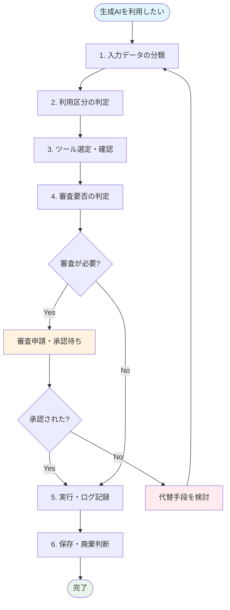
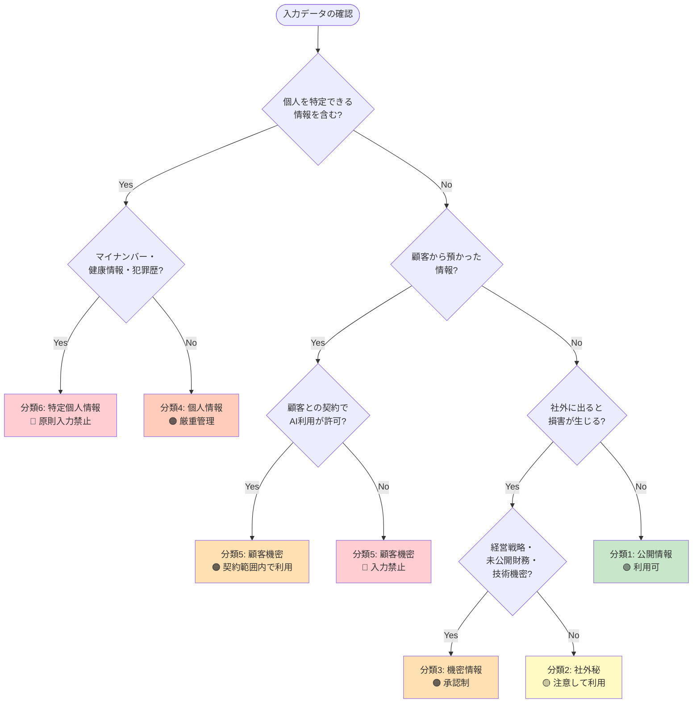
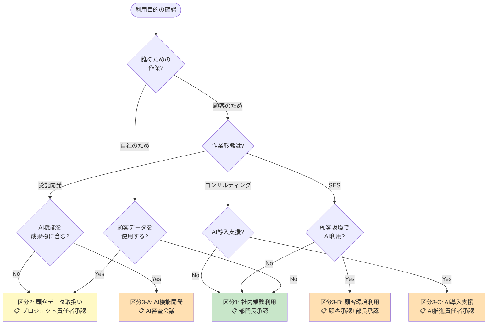
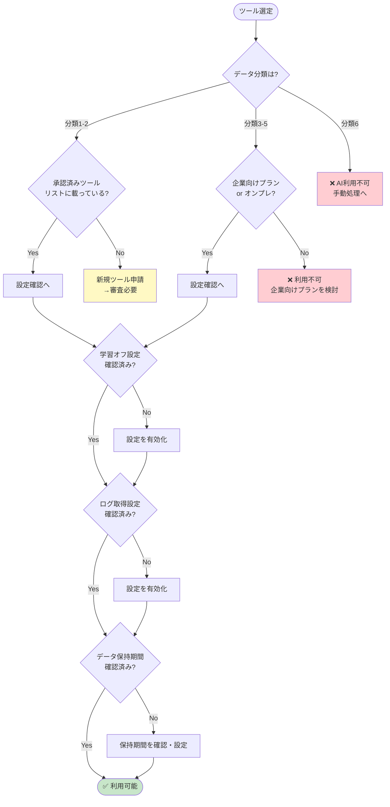
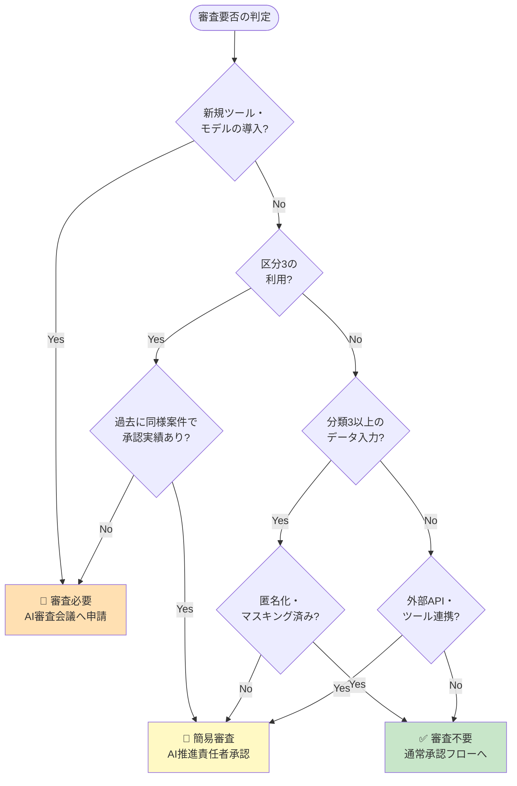
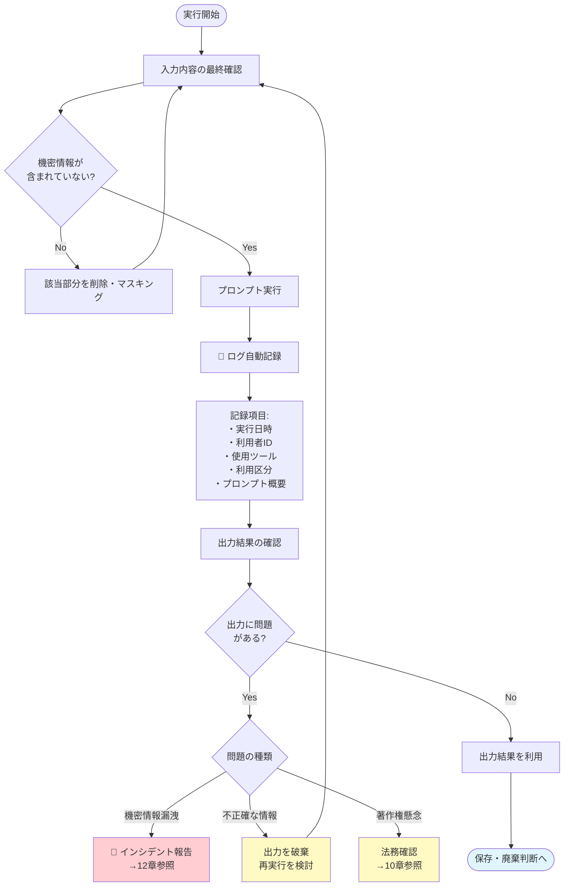
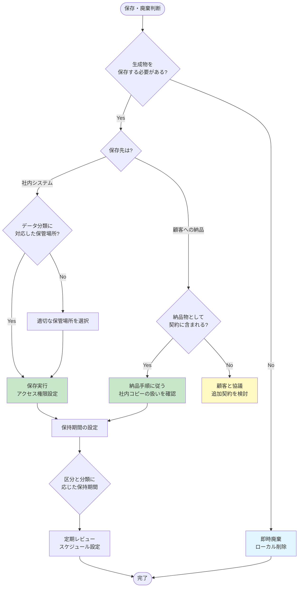

# 生成AI利用 判断フローチャート

**文書番号**: GL-AI-004
**版数**: 1.0
**最終更新日**: 2025年1月
**根拠**: 総務省AI事業者ガイドライン p.38-39、IPA生成AIガイドライン p.37-42

---

## 目次

1. [全体フロー概要](#1-全体フロー概要)
2. [入力データ分類フロー](#2-入力データ分類フロー)
3. [利用区分判定フロー](#3-利用区分判定フロー)
4. [ツール選定・確認フロー](#4-ツール選定確認フロー)
5. [審査要否判定フロー](#5-審査要否判定フロー)
6. [実行・ログ記録フロー](#6-実行ログ記録フロー)
7. [保存・廃棄判断フロー](#7-保存廃棄判断フロー)
8. [クイックリファレンス](#8-クイックリファレンス)

---

## 1. 全体フロー概要

生成AI利用時の判断プロセス全体像を示します。



---

## 2. 入力データ分類フロー

**根拠**: IPA生成AIガイドライン p.40-41「入力情報の制限」

入力しようとしているデータの機密レベルを判定します。



### データ分類早見表

| 分類 | 例 | 入力可否 | 必要な措置 |
|-----|-----|---------|-----------|
| 分類1: 公開 | Webサイト掲載情報、プレスリリース | ✅ 可 | なし |
| 分類2: 社外秘 | 社内手順書、会議メモ | ⚠️ 条件付 | 学習オフ確認 |
| 分類3: 機密 | 経営計画、未発表製品情報 | ⚠️ 承認制 | 部長承認 |
| 分類4: 個人情報 | 氏名+連絡先、社員情報 | ⚠️ 厳重管理 | 匿名化推奨 |
| 分類5: 顧客機密 | 顧客のソースコード、設計書 | ⚠️ 契約確認 | 顧客許可必須 |
| 分類6: 特定個人情報 | マイナンバー、健康診断結果 | ❌ 禁止 | 代替手段 |

---

## 3. 利用区分判定フロー

**根拠**: 総務省ガイドライン p.30-39「各主体の取組事項」

利用目的と対象に基づいて利用区分を判定します。



### 利用区分別の要件サマリ

| 区分 | 主な用途 | 承認者 | 主要要件 |
|-----|---------|--------|---------|
| 区分1 | コード補助、文書作成、調査 | 部門長 | 学習オフ設定確認 |
| 区分2 | 顧客データ分析、テストデータ生成 | PJ責任者 | 契約確認、匿名化 |
| 区分3-A | AI機能を含む受託開発 | AI審査会議 | 責任分界、品質基準 |
| 区分3-B | SESで顧客環境のAI利用 | 顧客+部長 | 顧客規程遵守 |
| 区分3-C | AIコンサルティング | AI推進責任者 | 助言範囲明確化 |

---

## 4. ツール選定・確認フロー

**根拠**: IPA生成AIガイドライン p.31-33「システム構築環境」

適切なツールを選定し、設定を確認します。



### 承認済みツールと設定チェック

| ツール | 対応分類 | 必須設定 | 確認方法 |
|-------|---------|---------|---------|
| Azure OpenAI | 1-5 | データオプトアウト済み | Azure Portal |
| AWS Bedrock | 1-5 | モデル呼び出しログ有効 | CloudWatch |
| ChatGPT Enterprise | 1-4 | 学習オフ（デフォルト） | 管理コンソール |
| Claude Enterprise | 1-4 | 学習オフ（デフォルト） | 管理コンソール |
| Gemini for Google Workspace | 1-3 | 管理者設定確認 | Google Admin |
| 自社構築（オンプレ） | 1-5 | 社内セキュリティ基準 | インフラチーム |

---

## 5. 審査要否判定フロー

**根拠**: IPA生成AIガイドライン p.52-60「リスクアセスメント」

審査申請が必要かどうかを判定します。



### 審査レベル別の対応

| 審査レベル | トリガー | 審査者 | 所要期間目安 |
|-----------|---------|--------|------------|
| 審査不要 | 区分1-2、分類1-2、既存ツール | 部門長 | 即日 |
| 簡易審査 | 区分3（実績あり）、分類3データ | AI推進責任者 | 2-3営業日 |
| 正式審査 | 新規ツール、区分3（新規）、外部連携 | AI審査会議 | 1-2週間 |

---

## 6. 実行・ログ記録フロー

**根拠**: 総務省ガイドライン p.18-20「透明性」、IPA p.43-46「透明性確保」

実際の利用時のログ記録と確認事項を示します。



### ログ記録要件

| 項目 | 区分1 | 区分2 | 区分3 |
|-----|-------|-------|-------|
| 実行日時 | ✅ | ✅ | ✅ |
| 利用者ID | ✅ | ✅ | ✅ |
| 使用ツール | ✅ | ✅ | ✅ |
| プロンプト概要 | - | ✅ | ✅ |
| 入力データ分類 | - | ✅ | ✅ |
| 出力結果概要 | - | - | ✅ |
| 顧客・プロジェクト名 | - | ✅ | ✅ |

---

## 7. 保存・廃棄判断フロー

**根拠**: IPA生成AIガイドライン p.46-49「運用ルール」

生成物の保存・廃棄を判断します。



### 保持期間ガイドライン

| データ分類 | 利用区分 | 推奨保持期間 | 廃棄方法 |
|-----------|---------|------------|---------|
| 分類1-2 | 区分1 | 必要期間のみ | 通常削除 |
| 分類3 | 区分1-2 | 1年 | 完全削除 |
| 分類4-5 | 区分2-3 | プロジェクト終了+1年 | 完全削除+記録 |
| - | 区分3（受託） | 契約に基づく | 契約に基づく |

---

## 8. クイックリファレンス

### 5分で判断するための早見表

```
【STEP 1】入力データは何？
  └─ 個人情報あり → 匿名化 or 入力禁止
  └─ 顧客データ → 契約確認必須
  └─ 機密情報 → 承認必要
  └─ 上記以外 → STEP 2へ

【STEP 2】誰のため？
  └─ 自社業務 → 区分1（部門長承認）
  └─ 顧客データ使用 → 区分2（PJ責任者承認）
  └─ 顧客向け開発・SES → 区分3（審査会議）

【STEP 3】ツールは承認済み？
  └─ 承認済み → 設定確認して利用
  └─ 未承認 → 新規ツール申請

【STEP 4】審査が必要？
  └─ 新規ツール・区分3（初回） → 正式審査
  └─ 区分3（実績あり）・機密データ → 簡易審査
  └─ それ以外 → 審査不要

【STEP 5】利用後
  └─ ログ記録を確認
  └─ 出力を検証
  └─ 保存/廃棄を判断
```

### 困ったときの連絡先

| 状況 | 連絡先 | 対応 |
|-----|-------|------|
| 判断に迷う | AI推進責任者 | 相談・助言 |
| 緊急インシデント | 情報セキュリティ責任者 | 即時対応 |
| ツール追加希望 | AI審査会議事務局 | 申請受付 |
| 顧客対応で困った | 営業担当+法務 | 契約確認 |

---

## 関連文書

- [生成AI導入ガイドライン](./introduction.md) - 詳細ルール
- [生成AI利用チェックリスト](./checklist.md) - 簡易判断表
- [例外申請テンプレート](./exception.md) - 申請フォーマット
- [要件トレーサビリティ表](./traceability.md) - 根拠一覧

---

## 改定履歴

| 版数 | 日付 | 改定内容 | 承認者 |
|-----|------|---------|-------|
| 1.0 | 2025年1月 | 初版作成 | AI推進責任者 |
